<!-- PROJECT LOGO -->
<br />
<p align="center">
  <a href="https://github.com/shubhamkhunt04/mood-enhancer-player">
    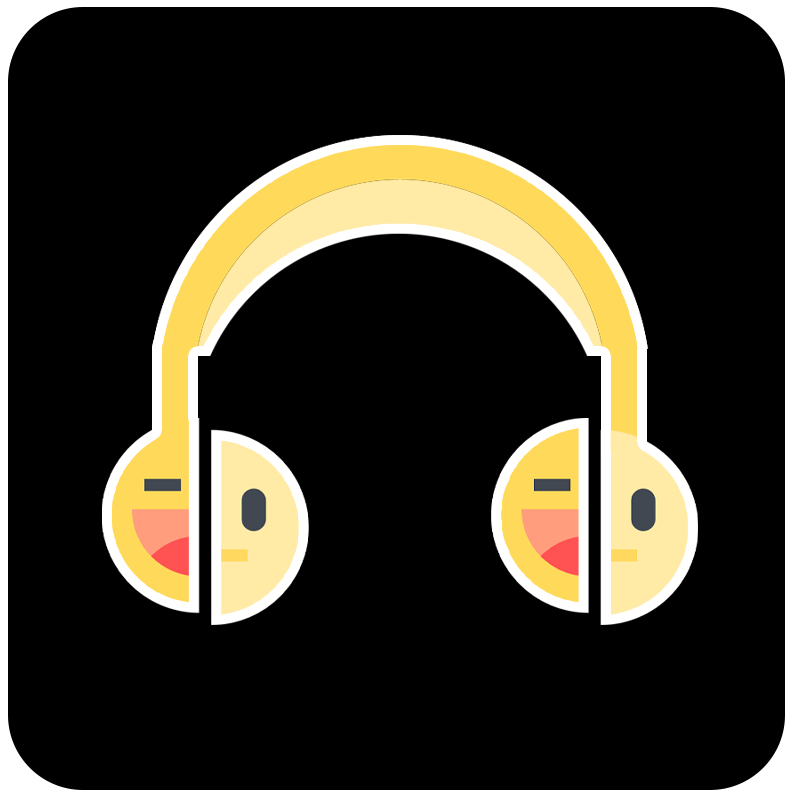
  </a>

  <h3 align="center">Mood Enhancer Player</h3>

  <p align="center">
    A web app that helps you to enhance your mood.
    <br />
    <br />

<!-- ABOUT THE PROJECT -->

# About The Project

The proposed project focuses on enhancing the users mood by recognizing users emotions and recommending the song playlist on web application.

The web based application uses facial recognition to recognize users emotions to creates a playlist which aid the user to enhance its mood.

For example, If the user is sad the system will recommend and create a playlist which would make the users mood happy.

# Built With

## Frontend

- [React](https://reactjs.org/)
- [Material-Ui](https://material-ui.com/)
- [Apollo-Client](https://www.apollographql.com/docs/react)

## Backend

- [GraphQL](https://graphql.org)
- [MongoDB and Mongoose](https://mongoosejs.com/)
- [Apollo-Server](https://www.apollographql.com/docs/apollo-server/)

## Cloud Platform for storage

- [AWS S3 bucket](https://docs.aws.amazon.com/AWSCloudFormation/latest/UserGuide/aws-properties-s3-bucket.html)<br/><br/>

# Project WorkFlow

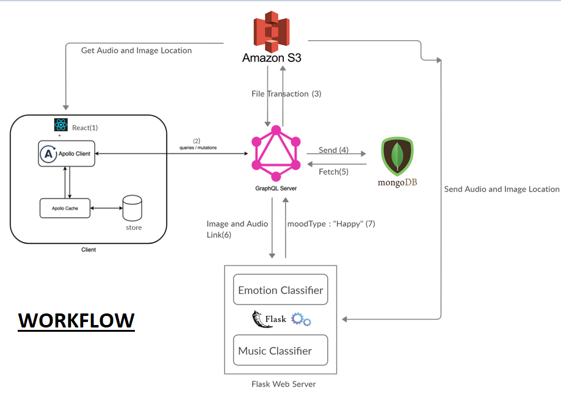<br/><br/>


# Prerequisites

This is an example of how to list things you need to use the software and how to install them.

- npm
  ```sh
  npm install npm@latest -g
  ```

# Installation

1. Clone the repo
   ```sh
   git clone https://github.com/mood-enhancer-player/mood-enhancer-player-server.git
   ```
2. Install NPM packages
   ```sh
   npm install
   ```
3. Enter your Credential in `.env`

4. To start development server run 
   ```sh
   npm start
   ```

# Project Screenshot

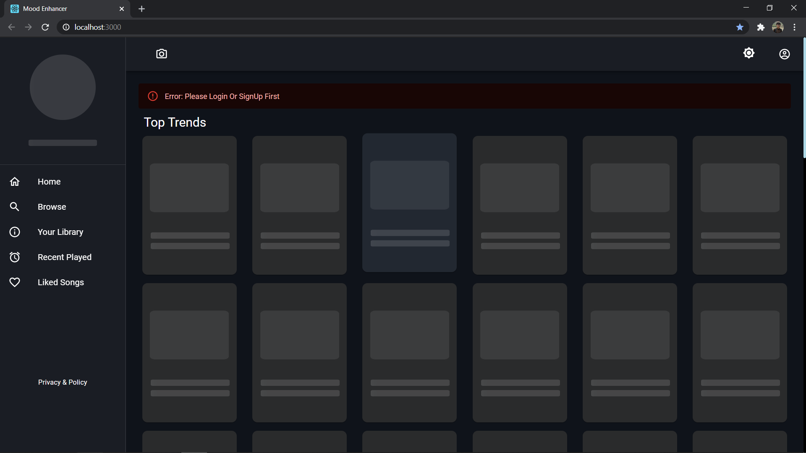<br/><br/>

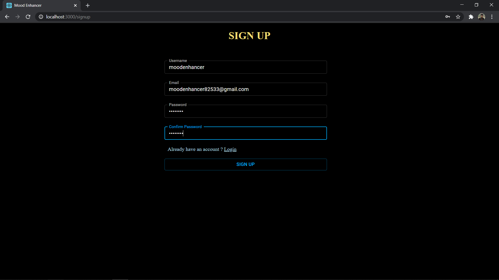<br/><br/>

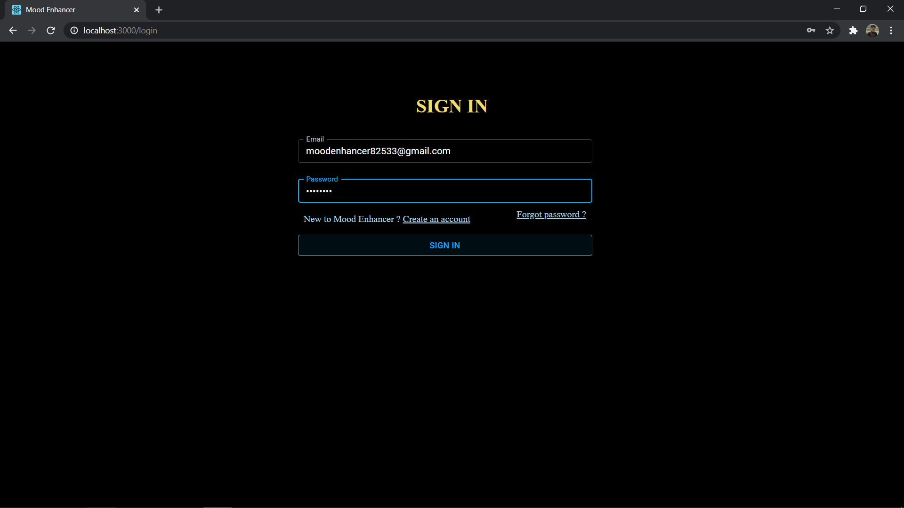<br/><br/>

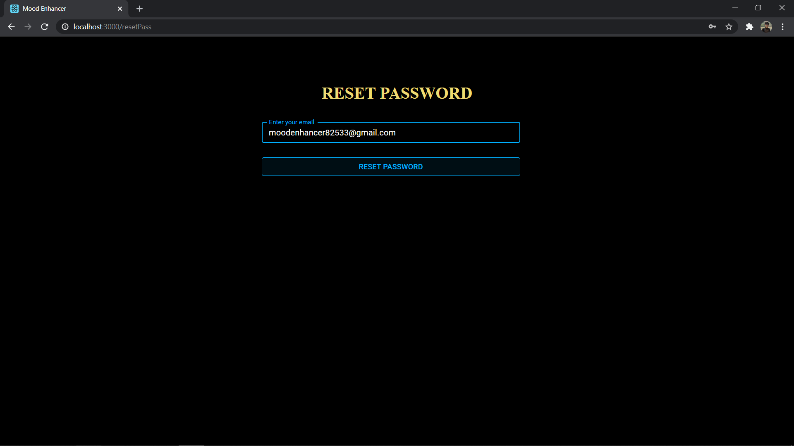<br/><br/>

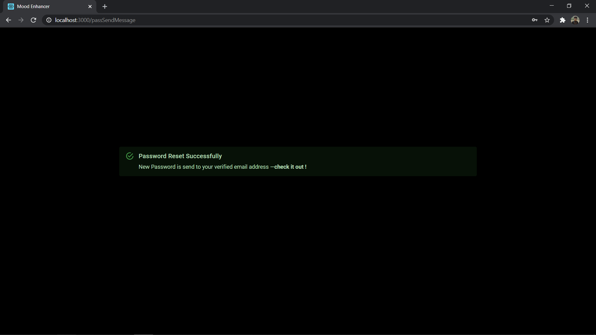<br/><br/>

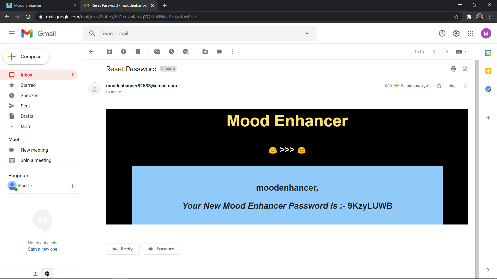<br/><br/>

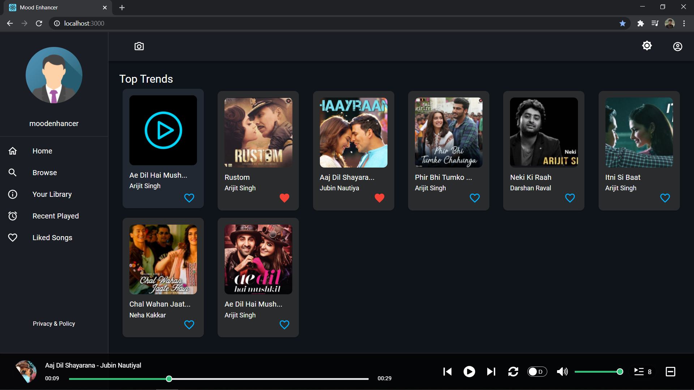<br/><br/>

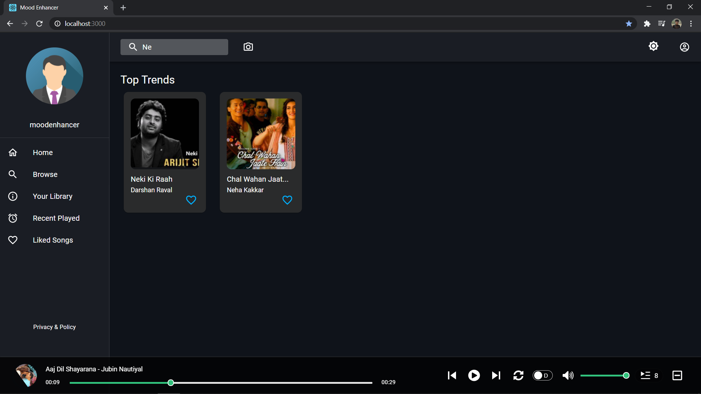<br/><br/>

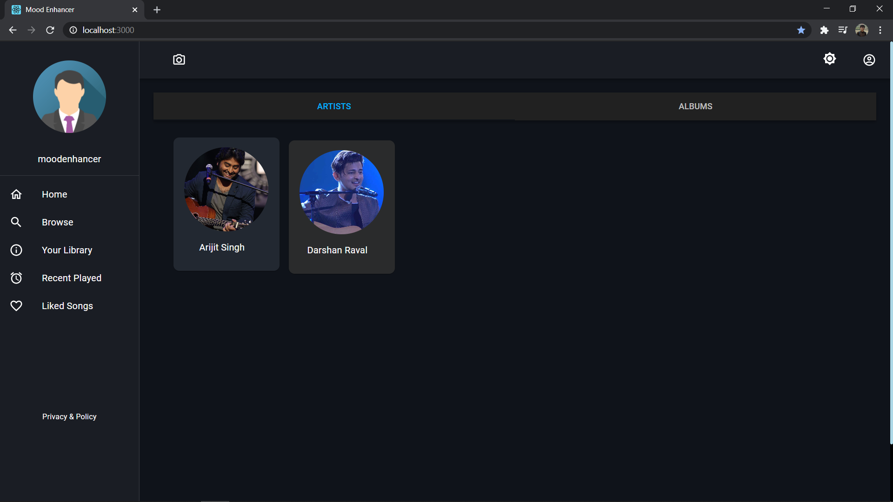<br/><br/>

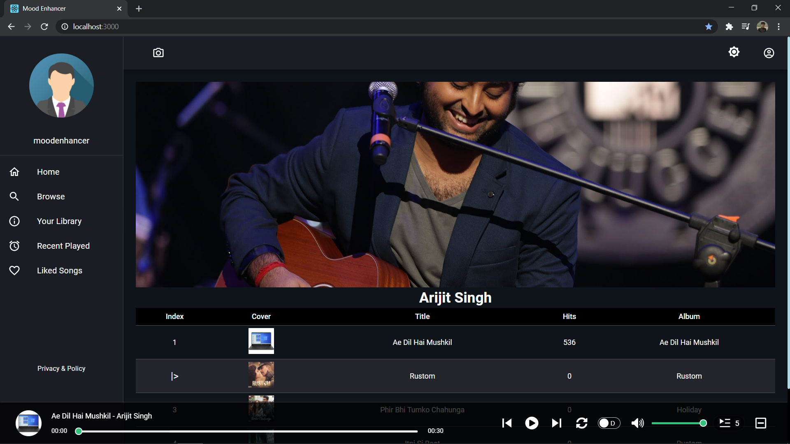<br/><br/>

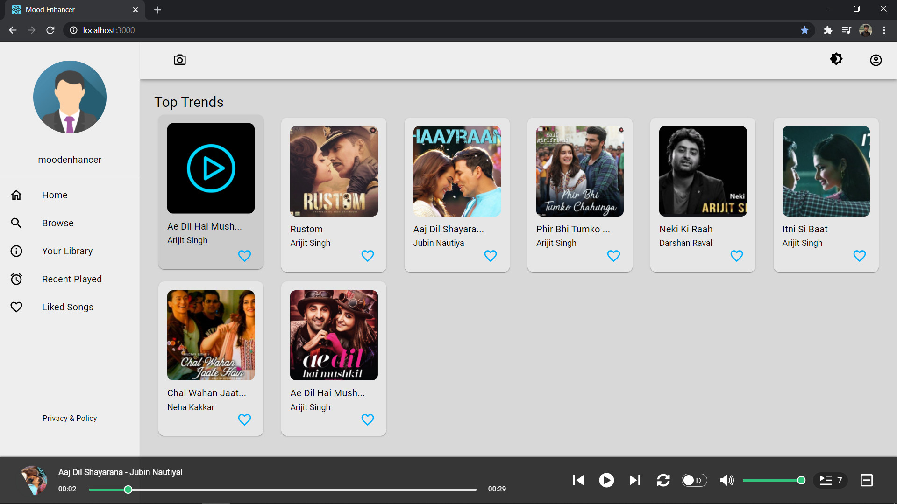<br/><br/>

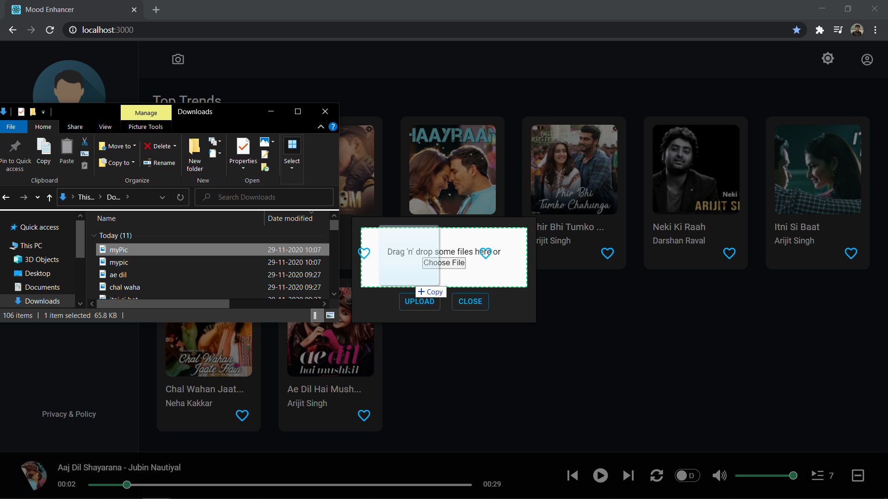<br/><br/>

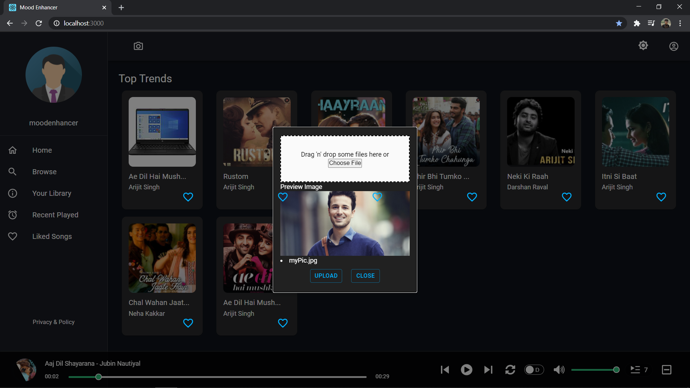<br/><br/>

# Admin Panel

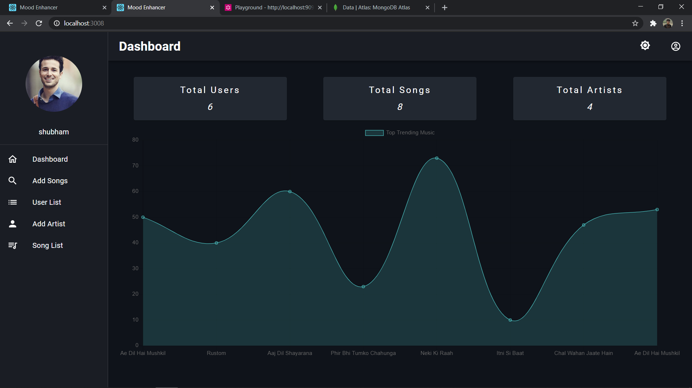<br/><br/>

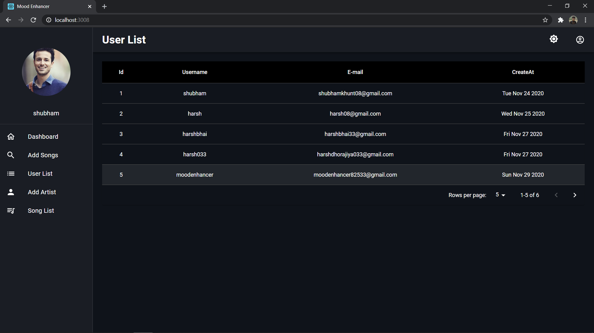<br/><br/>

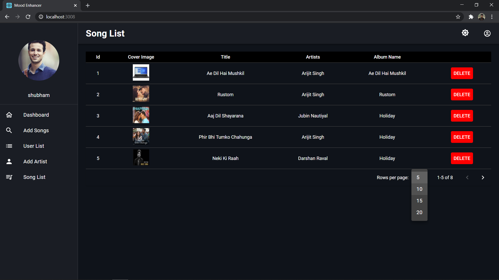<br/><br/>


<!-- LICENSE -->

## License

Distributed under the MIT License. See `LICENSE` for more information.

